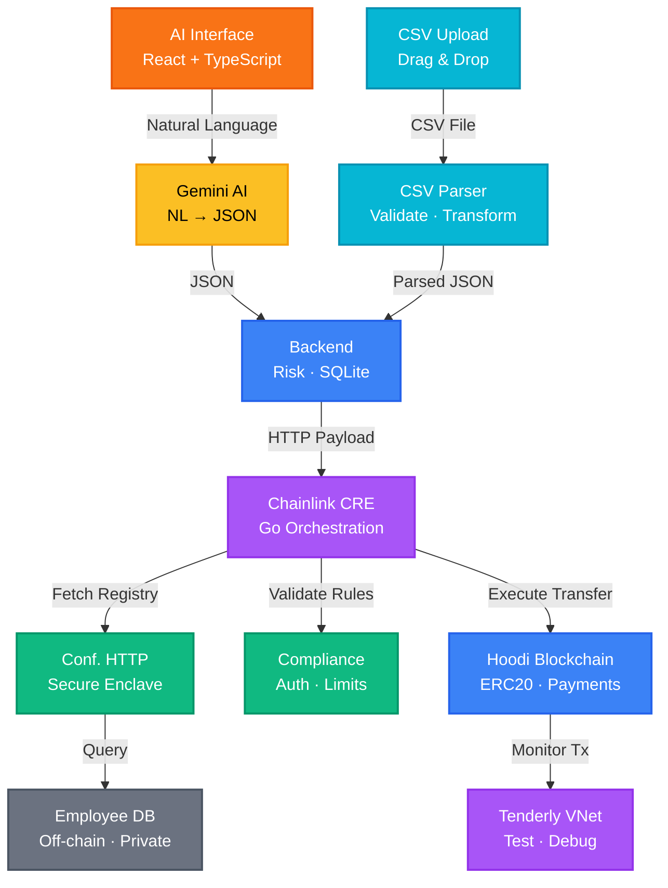
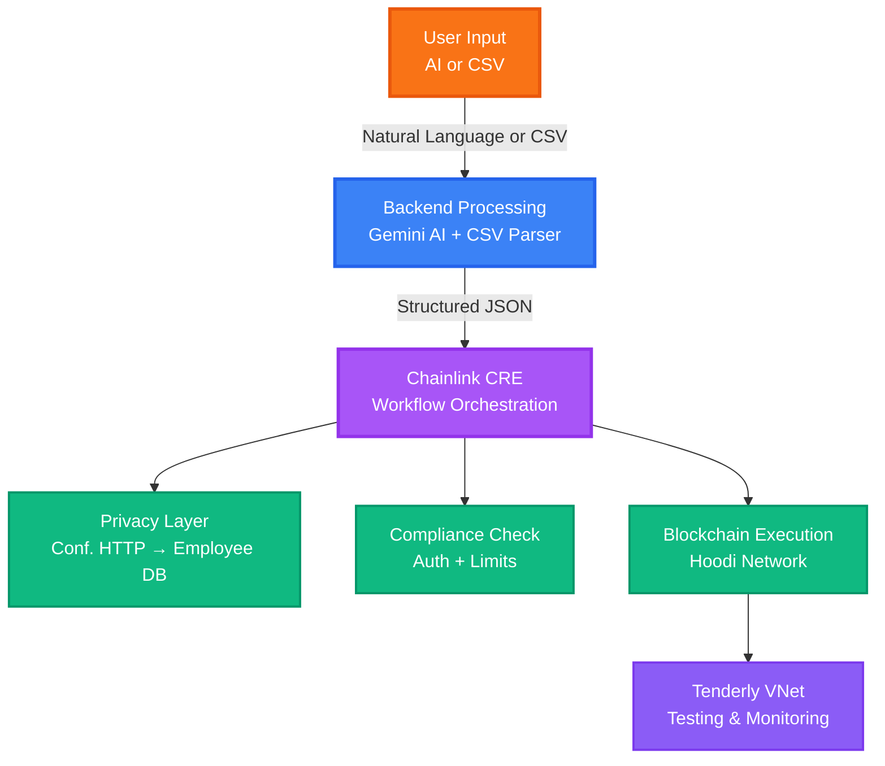
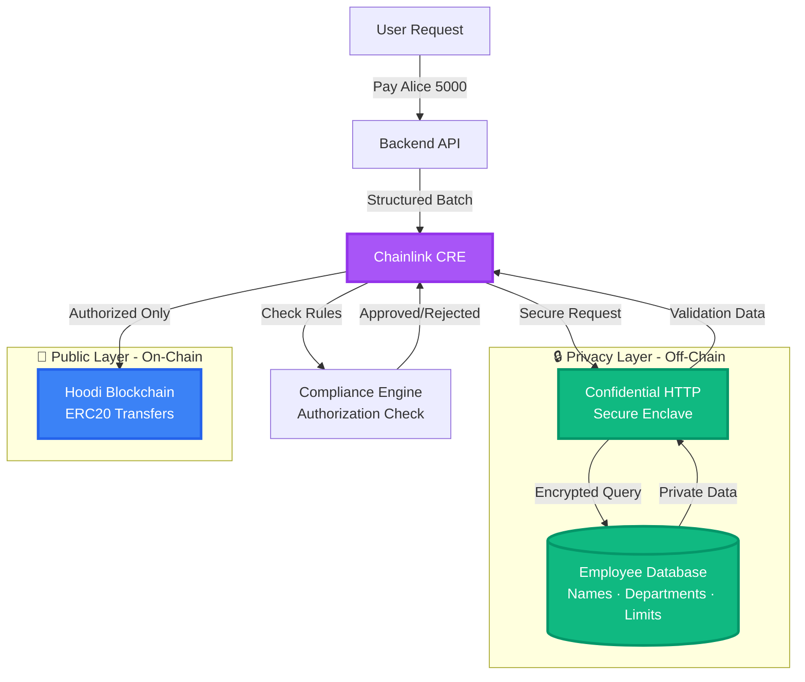
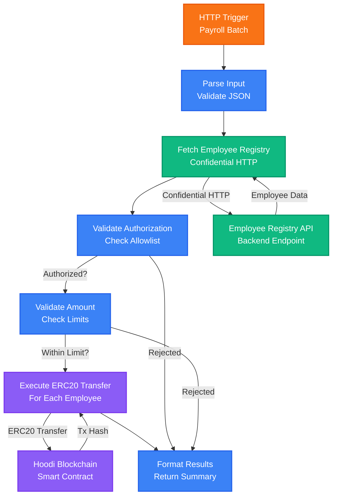
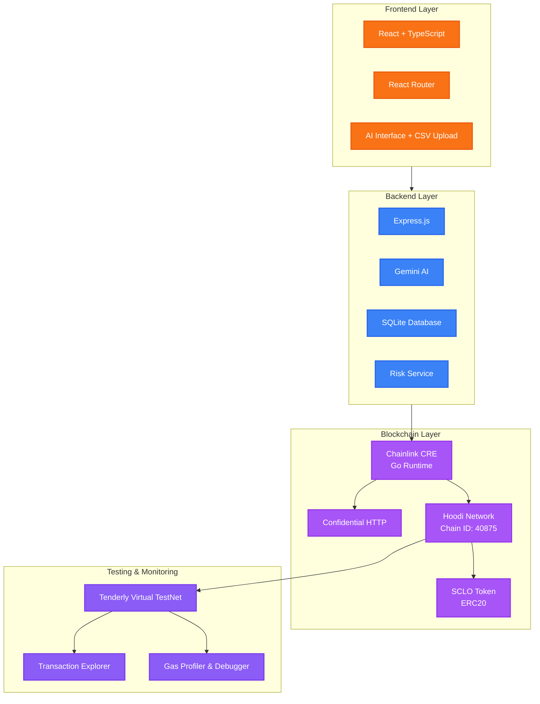

# SECLO Architecture - Mermaid Diagrams

## Complete System Architecture

---

## Simplified Flow Diagram

---

## Privacy-Focused Architecture

---

## CRE Workflow Detail

---

## Data Privacy Flow

```mermaid
graph LR
    %% What Goes Where
    subgraph OnChain["⛓️ ON-CHAIN (Public)"]
        WalletAddr[Wallet Addresses]
        Amounts[Payment Amounts]
        TxHash[Transaction Hashes]
        Status[Success/Failure Status]
    end
    
    subgraph OffChain["🔒 OFF-CHAIN (Private)"]
        Names[Employee Names]
        Departments[Departments]
        Limits[Salary Limits]
        Rules[Authorization Rules]
    end
    
    subgraph CRE["Chainlink CRE<br/>Secure Compute"]
        Validation[Validation Logic]
    end
    
    OffChain -->|Confidential HTTP| CRE
    CRE -->|Only Decisions| OnChain
    
    %% Styling
    classDef public fill:#3b82f6,stroke:#2563eb,stroke-width:3px,color:#fff
    classDef private fill:#10b981,stroke:#059669,stroke-width:3px,color:#fff
    classDef secure fill:#a855f7,stroke:#9333ea,stroke-width:3px,color:#fff
    
    class WalletAddr,Amounts,TxHash,Status public
    class Names,Departments,Limits,Rules private
    class Validation secure
```

---

## Technology Stack Diagram

---

## How to Use These Diagrams

### For PowerPoint:
1. Go to https://mermaid.live
2. Copy any diagram code above
3. Paste into the editor
4. Export as PNG or SVG
5. Insert into your PowerPoint slides

### For GitHub README:
- GitHub supports Mermaid natively
- Just paste the code blocks into your README.md
- They'll render automatically

### For Documentation:
- Use the "Complete System Architecture" for overview
- Use "Privacy-Focused Architecture" for privacy explanation
- Use "CRE Workflow Detail" for technical deep dive
- Use "Data Privacy Flow" for compliance discussion

---

## Recommended Diagram per Slide

**Slide 4 (Architecture Overview):**
- Use "Complete System Architecture"

**Slide 6 (Privacy Features):**
- Use "Data Privacy Flow"

**Slide 5 (CRE Integration):**
- Use "CRE Workflow Detail"

**Slide 11 (Technical Highlights):**
- Use "Technology Stack Diagram"

---

All diagrams are corrected with proper connections:
- ✅ Conf. HTTP → Employee DB (not CRE → Employee DB)
- ✅ Hoodi → Tenderly VNet (monitoring relationship)
- ✅ All labels and flows accurate
